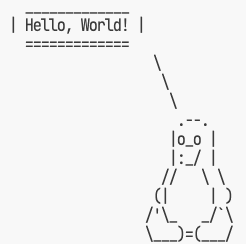
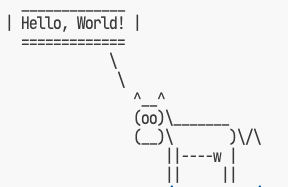

# Pythonお勉強会

## 仮想環境

---

# 仮想環境とは

- 仮想環境とは、プロジェクトごとに独立したPython環境を作成すること
- 仮想環境を使うことで、プロジェクトごとに異なるバージョンのライブラリを使うことができる
- 仮想環境を使うことで、プロジェクトごとに異なるPythonバージョンを使うことができる

---

# 事前知識: pip

- Pythonではライブラリが豊富に存在します(OpenCVとかね)
- それらのライブラリをインストールするためには`pip`というツールを使います
    - `pip`はPythonのパッケージ管理ツールです

試してみよう!(『ターミナル』にて)

---

# pip install

```bash
$ cd sampleA
$ python hello.py # NG
$ pip install cowsay
$ python hello.py # OK
```


---

# パッケージ汚染

同じPythonを使う他プログラムも認識できる

```bash
$ cd ../sampleB
$ python hello.py # OK
```


---

# 良いのか悪いのか

* 一度入れれば他でも使えて楽という考え方もある
* 実際にはそうも行かないことがある
    * ライブラリのバージョンが違うと動かないことがある
    * ライブラリのバージョンが違うと動作が違うことがある

**利用する環境毎に切り分ける**方が現状では理にかなうことが多い
→ **仮想環境** の構築

---

# 仮想環境の構築

Pythonではいくつかのツールがある
以下は雑に出現順

* venv(旧virtualenv)
* conda ※使うな
* pipenv
* poetry
* rye

---

# ちょっと準備

さっき入れた(グローバルな)cowsayは消しておこう

$ pip uninstall cowsay # yで答えること

---

# venv(virtualenv)

Pythonコマンドとライブラリを独立させられる
```bash
$ cd sampleA
$ python -m venv .venv # .venv以下に環境を構築
$ . .venv/bin/activate # 環境切り替え
$ pip install cowsay
$ python hello.py # OK
$ deactivate # 環境を抜ける ※ ここ大事
```
でもsampleB側では動かない
```bash
$ cd ../sampleB
$ python hello.py #NG
```

---

# venvの問題点

一度有効化(`activate`)すると他のディレクトリでも使えてしまう
* `deactivate` するまでは有効
* 端末(セッション)を閉じれば無効になる
* **ワンショット実行**が無い

とはいえ環境の閉じ込めはある程度可能(実際pipは作った環境内でしか使えない)
