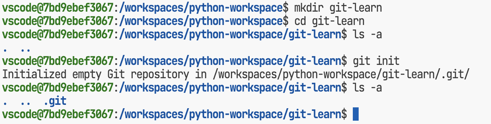
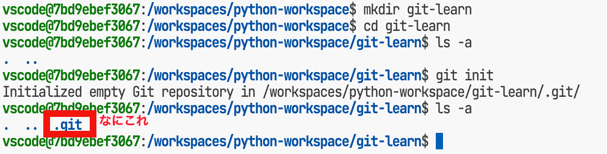
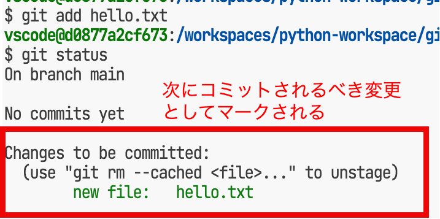
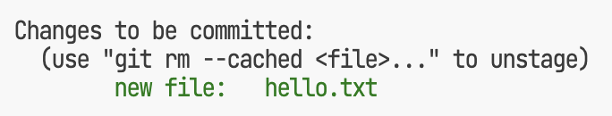
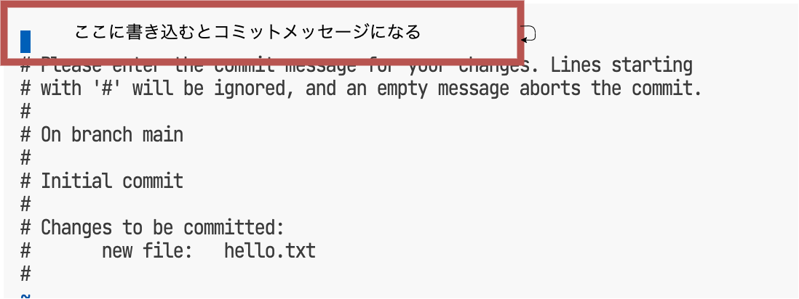
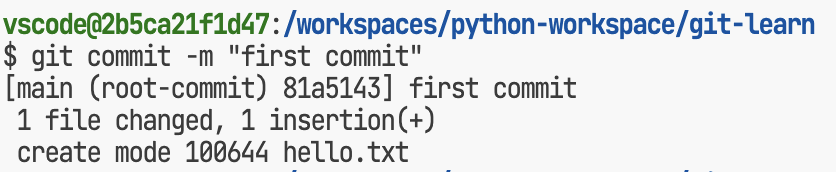

# 少しだけ内情を知るGit

神戸電子専門学校 佐藤大輔
<densuke@st.kobedenshi.ac.jp>

---

# Git 意識して使ってますか?

* Webアプリケーション開発で適当に使っているだけでは?
    * 課題の取得
    * 課題のコミット
    * 課題の提出(push)

---

# そこが本筋じゃない!

* そもそもgitの仕組み理解してる?
* してなくても使える?
* 解像度を高めて利用することが大切
    * なぜこうなった? の理由に至りやすくなる

---

# 今回やる事(2日/6時間分)

* 手動でのリポジトリ操作基本
    * 普段vscodeに頼り切りなのに喝!
* ステージングって?
    * コミットの粒度を考える
* コミットオブジェクトとコミットグラフ
* ブランチ

---

# 手動でのリポジトリ操作

ここでは自分でリポジトリを作って操作してみましょう。
何が起きてるのかを感じてください。

---

# ターミナルにてリポジトリを初期化する

1. ターミナルを開く
2. `mkdir git-learn` でディレクトリを作成
3. `cd git-learn` でディレクトリに移動
4. `git init` でリポジトリを初期化

---

# ターミナルにてリポジトリを初期化する

---

# ターミナルにてリポジトリを初期化する

---

# リポジトリの初期化とは

* `.git` ディレクトリが作成される
    * ここにリポジトリの情報が保存される
* ワーキングツリーが作成される
    * `.git`ディレクトリを作ったところ(以下)
    * 変更点の検出がgitコマンドにより今後行われる
        * `git status`

---

# 最初のコミットへ

まずはファイルをひとつ作ってみましょう

1. `echo hello > hello.txt` # ファイルをひとつ作成
2. `ls` # ファイルが作成されたことを確認
3. `git status` # gitからみた状態の確認

---

# 最初のコミットへ

---

# gitは状態を覚えてる

* もちろん最初は『何もない』状態
* ファイルが追加 → ワークツリー上の変化を検出(`git status`)

* だからって即座にgitは管理対象にしてくれない→追加

---

# 管理対象への追加
## ステージング

1. `git add hello.txt`
2. `git status`

---

# 管理対象への追加
## ステージング

---

# 管理対象への追加
## ステージング

ステージングとは

* 次にコミットに含めるべき対象を選択する
* コミットはステージに上げ(=含め)たものだけが対象となる
* ファイルを変更しても検出はするけどステージには上げてくれない
    * vscodeのgit管理画面では勝手にやるけどね
    * なぜこういう仕様なのかはあとでやる

---

# 管理対象への追加
## ステージング

* コミット対象にしたいファイルをひたすら選んでステージに上げていきましょう
* 逆に『このコミットに含めない』ものはステージから下げましょう
    * unstage 

---

# コミット

* ステージにあるものをリポジトリに登録する処理
* 登録はひとつの塊となる => コミット
    * 動詞化してる(『コミットする』英"commit")
* コミットに対しては『コミットメッセージ』が必須
    * オプションで空メッセージにはできるが非推奨
    * 誰のコミットかがわかるよう名前とメールアドレスの登録必須

---

# コミット
## コミットの流れ

* `git commit` もしくは `git commit -m "メッセージ"`
    * `-m`無しはエディタが立ち上がる(vi/vimが動くことが多い)
    * vscodeにてメッセージ無しでコミットすると罠発動

---

# コミット
## `-m`なしコミット

---

# コミット
## `-m`有りコミット

---

# コミット
## vscodeのgit GUIでメッセージ無し
