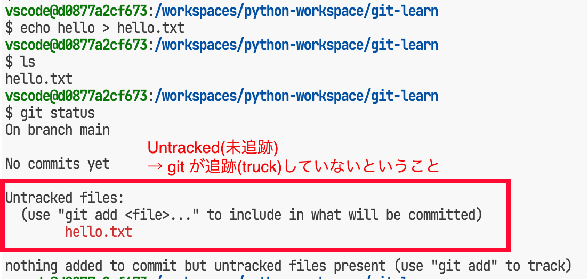

# 少しだけ内情を知るGit

神戸電子専門学校 佐藤大輔
<densuke@st.kobedenshi.ac.jp>

<script type="module">
import mermaid from 'https://cdn.jsdelivr.net/npm/mermaid@10/dist/mermaid.esm.min.mjs';

mermaid.initialize({ startOnLoad: true });

window.addEventListener('vscode.markdown.updateContent', function() { mermaid.init() });
</script>


---

# Git 意識して使ってますか?

* Webアプリケーション開発(4組はAS構築も)で適当に使っているだけでは?
    * 課題の取得
    * 課題のコミット
    * 課題の提出(push)

---

# そこが本筋じゃない!

* そもそもgitの仕組み理解してる?
* してなくても使える?
* 解像度を高めて利用することが大切
    * なぜこうなった? の理由に至りやすくなる

---

# 今回やる事(2日/6時間分)

* GitHubでのリポジトリ作成とclone
* 手動でのリポジトリ操作基本
    * 普段vscodeに頼り切りなのに喝!
* ステージングって?
    * コミットの粒度を考える
* コミットオブジェクトとコミットグラフ
* ブランチ

---

# GitHubでのリポジトリ作成

Gitの始め方は2つある
※ 「GitHub」部分は他のGitリポジトリに置換可能です

* GitHubからスタートしてローカルで持つ
* ローカルでスタートしてGitHubとつなぐ


---

# GitHubでのリポジトリ作成

**『ユーザー名/git-learn』** リポジトリを作ってみましょう

* https://github.com/ ※各自のアカウントでログイン
* "New"ボタン 
* リポジトリ名を設定 "ユーザー名/名前"
    * ユーザー名部分でユニーク性が担保されているところも大切


---

# リポジトリをクローンする

いつも?Webアプリで"Git: Clone"で取得したところはコレ

* `git clone XXXXXXXX` # 何を渡していた?
* `ls git-learn` # 空repoができている


---

# 手動でのリポジトリ操作

ここでは自分でリポジトリを作って操作してみましょう。
何が起きてるのかを感じてください。

`rm -fr git-learn`

---

# ターミナルにてリポジトリを初期化する

1. ターミナルを開く
2. `mkdir git-learn` でディレクトリを作成
3. `cd git-learn` でディレクトリに移動
4. `git init` でリポジトリを初期化

---

# ターミナルにてリポジトリを初期化する


---

# ターミナルにてリポジトリを初期化する


---

# リポジトリの初期化とは

* `.git` ディレクトリが作成される
    * ここにリポジトリの情報が保存される
* ワーキングツリーが作成される
    * `.git`ディレクトリを作ったところ(以下)
    * 変更点の検出がgitコマンドにより今後行われる
        * `git status`

---

# どう違うのか

少しだけ状況が異なります(同じにできるから大丈夫)
* GitHub -> Clone
    * 初期化済み状態でローカルにできる
    * いつでもpushできる
* ローカルinit
    * GitHubに繋がってない
    * なのでpush先が無い
    * これは登録すればOK
        * 手順はGitHubに書いてある

---

# おまけ: ghコマンド(gh-cli)

* 別途配布されているツール
* GitHubの操作をコマンドラインで行える
* 地味に便利
    * 認証処理だけでも地味に便利
    * [案内サイト](https://docs.github.com/ja/github-cli/github-cli/about-github-cli)

---

# 最初のコミットへ

まずはファイルをひとつ作ってみましょう

1. `echo hello > hello.txt` # ファイルをひとつ作成
2. `ls` # ファイルが作成されたことを確認
3. `git status` # gitからみた状態の確認

---

# 最初のコミットへ



---

# gitは状態を覚えてる

* もちろん最初は『何もない』状態
* ファイルが追加 → ワークツリー上の変化を検出(`git status`)

* だからって即座にgitは管理対象にしてくれない→追加

---

# 『追跡』とは

* 変更を監視する対象
    * status指示にて変更がないかを確認
    * あれば出力
* 初期状態では追跡対象にならない(適宜`add`する)
* 入れたくないものはファイル`.gitignore`にて設定

---

# 管理対象への追加
## ステージング

1. `git add hello.txt`
2. `git status`

---

# 管理対象への追加
## ステージング


---

# 管理対象への追加
## ステージング

ステージングとは

* 次にコミットに含めるべき対象を選択する
* コミットはステージに上げ(=含め)たものだけが対象となる
* ファイルを変更しても検出はするけどステージには上げてくれない
    * vscodeのgit管理画面では勝手にやるけどね

---

# 管理対象への追加
## ステージング

* コミット対象にしたいファイルをひたすら選んでステージに上げていきましょう
* 逆に『このコミットに含めない』ものはステージから下げましょう
    * unstage 


---

# コミット

* ステージにあるものをリポジトリに登録する処理
* 登録はひとつの塊となる => コミット
    * 動詞化してる(『コミットする』英"commit")
* コミットに対しては『コミットメッセージ』が必須
    * オプションで空メッセージにはできるが非推奨
    * 誰のコミットかがわかるよう名前とメールアドレスの登録必須

---

# コミット
## コミットの流れ

* `git commit` もしくは `git commit -m "メッセージ"`
    * `-m`無しはエディタが立ち上がる(vi/vimが動くことが多い)
    * vscodeにてメッセージ無しでコミットすると罠発動

---

# コミット
## `-m`なしコミット


---

# コミット
## `-m`有りコミット


---

# コミット
## vscodeのgit GUIでメッセージ無し

※ 慣れてないと地味にやるヤツ


---

# コミット
## 名前の登録が無いとNG

```bash
$ git config --global user.name "名前(英字ベース)"
$ git config --global user.email "メールアドレス"
```

* `git config --global -l` で `user.name`と`user.email`が登録されているか確認
* 無いなら以下で登録(変更も可能)


---

# コミットとは?

* コミットは「状態」を保有するものです
* 状態は固定化されるため、一度作ると変更されません(ダイジェスト値が確定)
    * ダイジェスト値が**コミットID**
* コミットにはいろいろ含まれている

<div class="mermaid">
gitGraph
    commit id: "A" type: HIGHLIGHT
</div>

---

# コミットとは?
## コミットに含まれるもの

* [詳細?](https://zenn.dev/kaityo256/articles/objects_of_git)
* 該当ファイルの一覧
    * 該当ファイル
    * ファイルの状態(追加/変更/削除)
* コミットした人(名前とメールアドレスがここで使われる)
* **親コミットのID**
* 日時情報 etc...

---

# コミットとは?
## 親コミットのIDが重要

コミットオブジェクトは散在している


---

# コミットとは?
## 親コミットのIDが重要

コミットオブジェクトは散在している


---

# コミットとは?
## 親コミットのIDが重要

並びを整理するとこうなる


---

# コミットとは?
## コミットグラフ

一般的に左→右、上→下の方向に表現するので逆さまにする


---

# コミットとブランチ

コミットは分岐可能なため、ブランチという概念がある
無指定のブランチ名は`main`が使われている


※ 古いリポジトリでは`master`が使われてます

---

# ブランチに対するコミット

* 通常コミット先ブランチとHEADは同じ場所を指す
* コミットをする
    * HEADが進む
    * ブランチが進む
* 次のコミットで試してみよう

---

# ブランチに対するコミット
## やってみる

* `git branch`  # 今のブランチを確認
    * 実例では`-v`足してます(コミットIDが出るように)
* `echo world > world.txt` # ファイルを追加
* `git status` # 状態を確認
* `git add world.txt` # ステージに上げる
* `git commit -m "Add world.txt"` # コミット

---

# ブランチに対するコミット
## やってみる


---

# ブランチに対するコミット
## 何が起きたか

<div class="mermaid">
%%{init: {
 'gitGraph': { 'rotateCommitLabel': false},
 'themeVariables': { 'commitLabelFontSize': '18px' }
} }%%
gitGraph
    commit id: "hello" type: HIGHLIGHT tag: "HEAD"
</div>

* HEADのコミットIDを取得(`git rev-paese HEAD`)
* コミットオブジェクトを生成(親は↑で取得したもの)
* HEADの指す位置を新しいコミットIDに変更
* mainの指す位置も同様に変更
    <div class="mermaid">
    %%{init: {
    'gitGraph': { 'rotateCommitLabel': false},
    'themeVariables': { 'commitLabelFontSize': '18px' }
    } }%%
    gitGraph
        commit id: "hello"
        commit id: "world" type: HIGHLIGHT tag: "HEAD"
    </div>


---

# 一休み: コミットを見てみよう

(`git log`以外は知らなくて良い操作です)
* `git log` # コミットログを見る(グラフを新→旧にたどる)
* `git ls-tree 最新のコミットID(先頭7桁程度)` # 含まれるファイルを見る
* `git cat-file -p 最新のコミットID` # コミットオブジェクトの内容取得
    * `tree` がファイルの一覧
    * `parent` が親コミットのID
    * `author` がコミットした人、`committer` がコミットした人
<!-- 普通は同じだけど、書いてる人(author)とマージする人(committer)が別になることはあります -->
* `git cat-file -p`にてblobのIDを渡せばファイルの内容が見れるぞ

---

# 一休み: コミットを見てみよう

* コミットIDがわかると内部的な動きをうかがい知ることができる
* コミットをすると参照中ブランチが伸びる

---

# 練習: コミットを進めてみよう

1. `hello.txt`の内容を"Hello, World!"に書き換えてコミットしてみましょう
    * メッセージは適当でいいよ
2. このコミットのIDを取得してみましょう(コミット時の出力やlogで)
3. このコミットの内容を見てみましょう
    * `hello.txt`ファイルのBLOB IDを取得して`cat-file`する
4. ひとつ前のコミットにおける`hello.txt`の内容を見てみましょう

    <div class="mermaid">
    %%{init: {
    'themeVariables': { 'commitLabelFontSize': '18px' }
    } }%%
    gitGraph
        commit id: "hello"
        commit id: "world"
        commit id: "hello world" type: HIGHLIGHT tag: "HEAD"
    </div>


---

# コミットの粒度

* コミットは適当にでも行えます
* とはいえいろいろ混ぜると後が大変
    * ログを見たときにわかりにくくなります

---

# コミットの粒度

* コミットは『ひとつの変更』に対して行う
    * 変更の理由がわかりやすくなる
    * ログを見たときにわかりやすくなる
* 『コミットしたらどうなるか』がイメージしやすいと良い
    * 例: 『〜のバグを修正』『〜の機能を追加』
    * ログやdiffとればわかる

---

# ブランチ

* 次になにをする? と考えてみる
    * 新機能を追加したい
    * 気づいたバグを修正したい
        * 軽く書き換えるような軽微なものではなく
    * 他の人のコードを取り込みたい
        * 動く保証は無い状況
* いきなりコミットするのは危険

---

# ブランチ

* 既存のブランチを分岐させる
    * ソフトⅢの授業ではmainぐらい 
    * そのブランチを元に新しいブランチを作成
* ブランチに対する変更は他のブランチに影響が出ない
    * 他のブランチに影響を与えることなく作業ができる
* ブランチの成果は元のブランチ(他)に持ち込むことができる
    * マージ(merge)
    * リベース(rebase)

---

# ブランチ

<div class="mermaid">
gitGraph
    commit
    commit
    commit
    branch hello-world
    checkout hello-world
    commit
    checkout main
    commit
    checkout hello-world
    commit
    checkout main
    merge hello-world
</div>

---

# ブランチを作ってみよう

* `git branch` # 初期状態ではmainのみ
* `git branch hello-world` # `hello-world`ブランチを作成
* `git branch` # 今のブランチを確認


<div class="mermaid">
gitGraph
    commit id: "hello"
    commit id: "world"
    commit id: "hw"
    branch "hello-world"
</div>


---

# ブランチを作ってみよう

この時点では同じコミットを複数の名前で指してるだけ


---

# ブランチの切り替え

`git switch hello-world` もしくは `git checkout hello-world`

* `git checkout`は古い方法(普通に出ますが)
* `git branch`で現在のブランチを確認するといい

<div class="mermaid">
gitGraph
    commit id: "hello"
    commit id: "world"
    commit id: "hw"
    branch "hello-world"
</div>

---

# hello.txtを改ざんする ※h-wブランチ上

`Hello, World!` → `Hello, Git!`

* `echo "Hello, Git!" > hello.txt`
* `git add hello.txt`
* `git commit -m "Hello, Git!"`

<div class="mermaid">
gitGraph
    commit id: "hello"
    commit id: "world"
    commit id: "hw"
    branch "hello-world"
    checkout "hello-world"
    commit id: "hello-git" type: HIGHLIGHT tag: "HEAD"
</div>


---

# ブランチを眺めてみる

```bash
$ git log # コミットIDを見つける
$ git ls-tree コミットID # hello.txtのblob IDを確認
$ git cat-file -p "blob ID" # hello.txtを参照
```

※ ひとつ前のコミットIDでのhello.txtと比較してみよう

---

# やってみよう(実習)

* `hello.txt`をコミット後、`main`ブランチに戻りましょう
* `world.txt`の内容を`Good Evening`に変更してコミットしてみましょう

<div class="mermaid">
gitGraph
    commit id: "hello"
    commit id: "world"
    commit id: "hw"
    branch "hello-world"
    checkout "hello-world"
    commit id: "hello-git"
    checkout "main"
    commit id: "good-evening" type: HIGHLIGHT tag: "HEAD"
</div>


---

# ブランチのマージ

* それぞれのブランチのコミットは独立して行える
* いつかはその変更を取り込まないといけない
* 取り込む操作 → **マージ(merge)**

---

# mainにhello-worldを取り込む

* `git switch main` # 取り込み先ブランチに移動
* `git merge hello-world` # hwブランチをマージしてmainに入れる

…できる?

<div class="mermaid">
gitGraph
    commit id: "hello"
    commit id: "world"
    commit id: "hw"
    branch "hello-world"
    checkout "hello-world"
    commit id: "hello-git"
    checkout "main"
    commit id: "good-evening" type: HIGHLIGHT tag: "HEAD"
    merge hello-world
</div>


---
